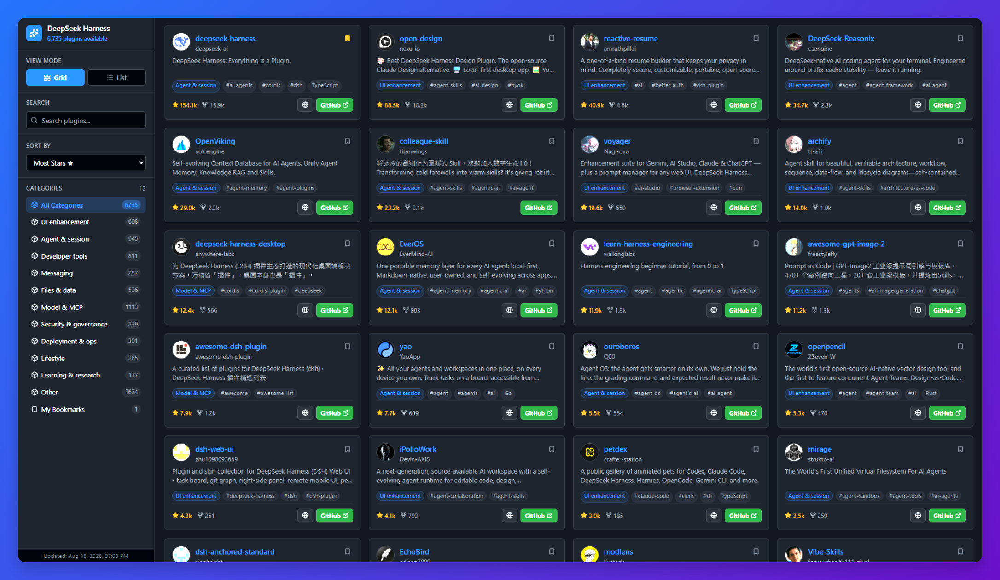

# DeepSeek Harness Plugin Explorer

A lightweight, fast, single-page web app built with **Bun**, **Vite**, and **React** to explore the DeepSeek Harness community plugins and extensions catalog offline.



## Design & Architecture

### 1. Technology Stack

- **Runtime & Package Manager**: [Bun](https://bun.sh) for fast dependency resolution and script execution.
- **Bundler & Tooling**: [Vite](https://vite.dev) with `@vitejs/plugin-react` and `vite-plugin-singlefile`.
- **UI Framework**: React 19 + TypeScript.
- **List & Grid Virtualization**: `@tanstack/react-virtual` to efficiently render 6,700+ plugins without DOM performance penalties.
- **Icons & Styling**: `lucide-react` with pure modern CSS custom properties (no bulky UI frameworks).

### 2. Architecture & Key Features

- **Offline First**: Directly imports and queries `catalog.json` (6,700+ plugins) in memory.
- **View Modes**: Toggle between multi-column **Grid view** and compact **List view**.
- **Virtualization & Infinite Scrolling**:
  - Automatically divides items into responsive grid rows / list rows.
  - Virtualizes rows with dynamic height estimation.
  - Incrementally loads batches (40 items/page) as the user scrolls down.
- **Exploration & Filtering**:
  - **Search**: Instant multi-attribute search across plugin name, full name, description, owner, language, and topics.
  - **Categories**: Category filter pills with plugin counts.
  - **Tags**: Click any topic or category tag on a plugin card to filter by that tag.
  - **Sorting**: Sort by Most Stars, Recently Updated, or Alphabetical (A-Z).
- **Metadata Display**:
  - Owner avatar / image thumbnail.
  - Repository name, author login, and description.
  - Stars count and forks count.
  - Direct links to GitHub repository and homepage (if available).
- **Single HTML Distribution**: Configured `vite-plugin-singlefile` to inline all JS, CSS, and catalog assets into `dist/index.html` for zero-dependency standalone usage.

---

## Getting Started

### Development

```bash
bun install
bun run dev
```

### Production Build

```bash
bun run build
```

Outputs the application at `dist/index.html` alongside `dist/catalog.json`.

---

## GitHub Actions Workflows

The repository includes automated CI/CD workflows under `.github/workflows/`:

### 1. GitHub Pages Deployment (`deploy.yml`)

- **Trigger**: Automatic on push to `main` / `master` or manually via `workflow_dispatch`.
- **Function**: Builds the client application using **Bun + Vite** and deploys `dist/` (including `catalog.json` and single-file `index.html`) to **GitHub Pages**.
- **Base Path Support**: Configured with relative base paths (`./`) to support both root custom domains and nested repository subpaths (`https://<username>.github.io/<repo>/`).

### 2. Automated Catalog Sync (`update-catalog.yml`)

- **Trigger**: Scheduled cron job (runs twice daily at 00:00 and 12:00 UTC) or manually via `workflow_dispatch`.
- **Function**: Executes `scripts/update-catalog.ts` with Bun to fetch repositories tagged with topic `dsh-plugin` via the GitHub API, categorizes them automatically, and syncs `catalog.json`.
- **Safe PR Workflow**: Commits updates to an isolated branch (`bot/catalog-update`) and creates a **Pull Request** for review. Automatically skips PR creation if no catalog changes are detected.
